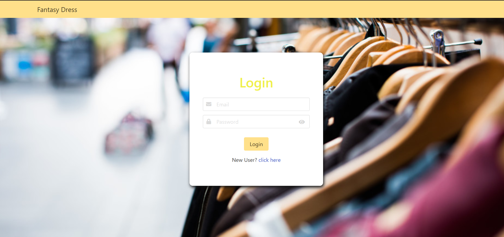
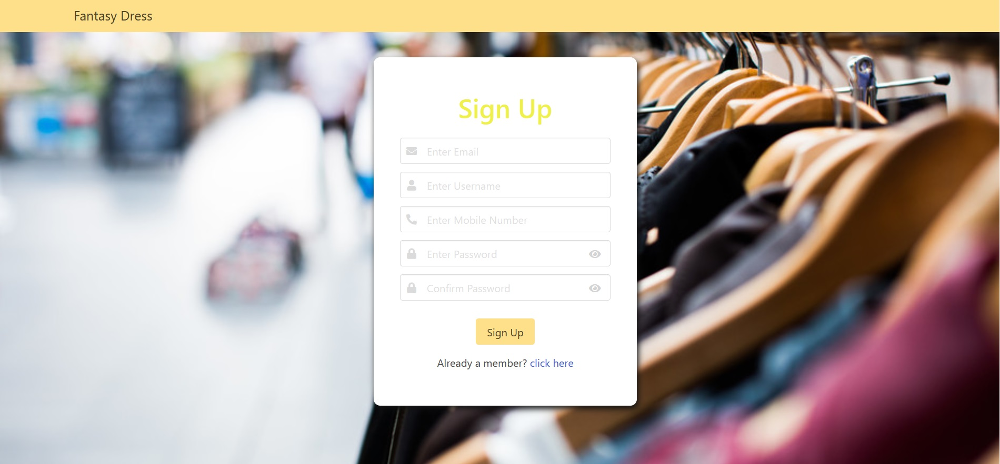
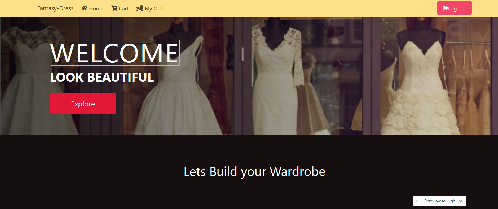
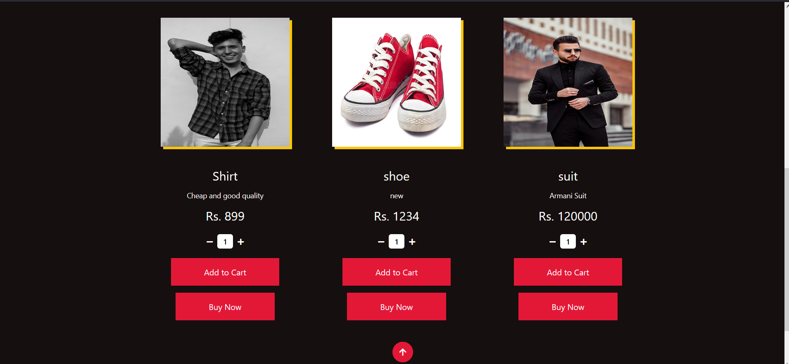
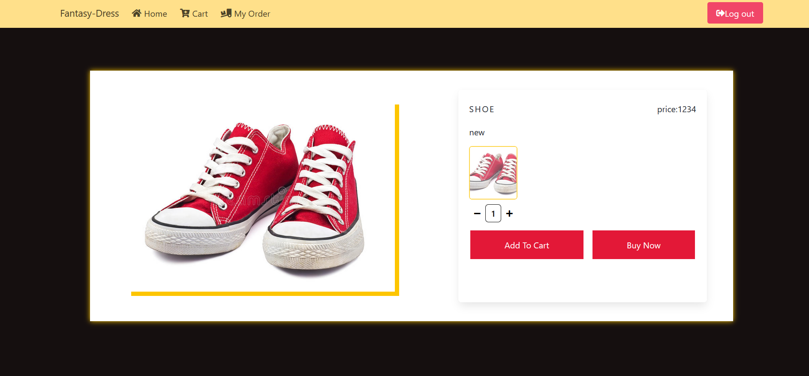
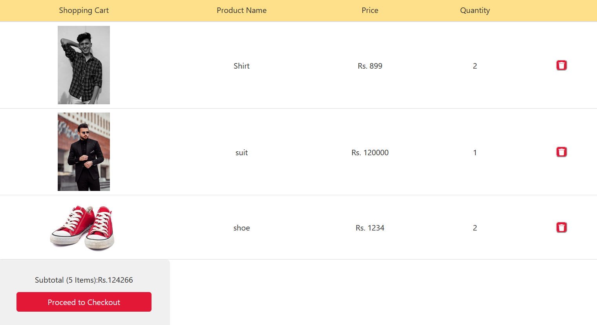
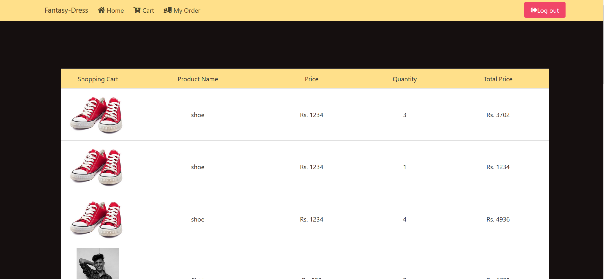
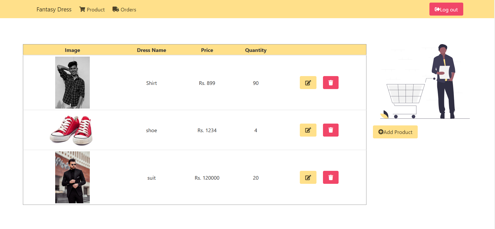
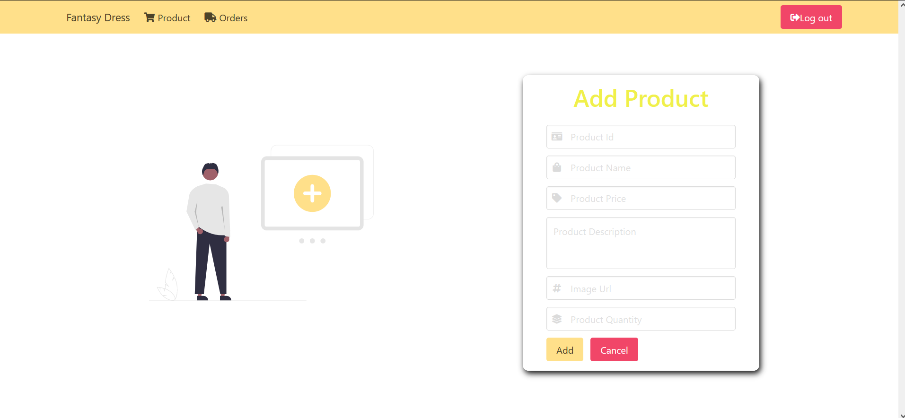
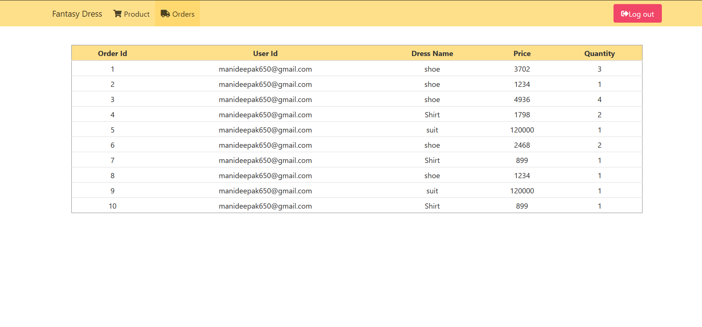

# Fantasy Dress

---

&nbsp;&nbsp;&nbsp;&nbsp;&nbsp;&nbsp;&nbsp; A Dress shopping website created using React, Spring Boot and MySql. It was a project submitted for Virtusa Neural Hack Season 5.

#### 👨‍💻 Tech Stack

- **React** : Frontend
- **Spring Boot** : Backend
- **MySql** : Database

#### 🖼 ScreenShots Of Website

##### Login Page

##### Sign Up Page

##### User Home Page

##### User Product Details Page

##### User Cart Page

##### User Orders Page

##### Admin Home Page

##### Admin Add Products Page

##### Admin Orders Page

